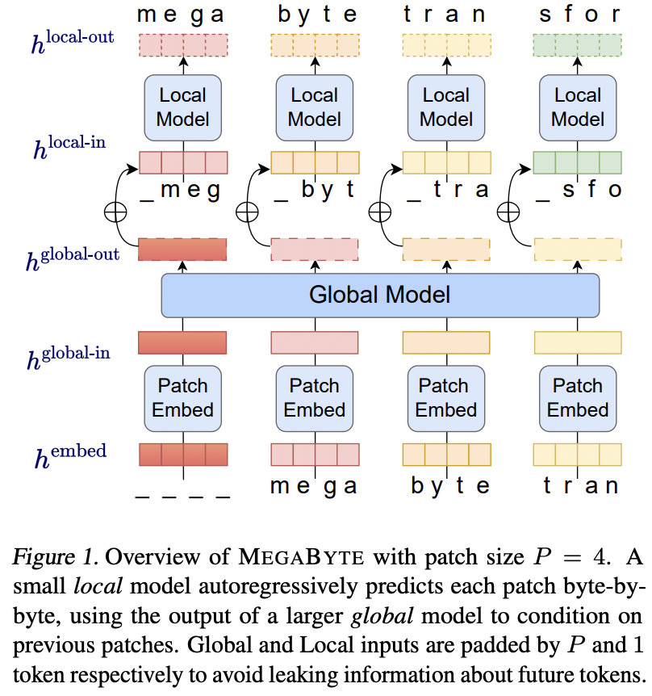

</img>

## MEGABYTE - Pytorch

Implementation of <a href="https://arxiv.org/abs/2305.07185">MEGABYTE</a>, Predicting Million-byte Sequences with Multiscale Transformers, in Pytorch. Took the liberty to generalize it even further so one can have multiple local models.

<a href="https://github.com/lucidrains/simple-hierarchical-transformer">Similar independent research that is a further generalization</a>

## Appreciation

- <a href="https://stability.ai/">Stability</a> and <a href="https://huggingface.co/">🤗 Huggingface</a> for the generous sponsorship to work on and open source cutting edge artificial intelligence research

## Install

```bash
$ pip install MEGABYTE-pytorch
```

## Usage

```python
import torch
from MEGABYTE_pytorch import MEGABYTE

model = MEGABYTE(
    num_tokens = 16000,             # number of tokens
    dim = (512, 256),               # transformer model dimension (512 for coarsest, 256 for fine in this example)
    max_seq_len = (1024, 4),        # sequence length for global and then local. this can be more than 2
    depth = (6, 4),                 # number of layers for global and then local. this can be more than 2, but length must match the max_seq_len's
    dim_head = 64,                  # dimension per head
    heads = 8,                      # number of attention heads
    flash_attn = True               # use flash attention
)

x = torch.randint(0, 16000, (1, 1024, 4))

loss = model(x, return_loss = True)
loss.backward()

# then after much training

logits = model(x)

# and sample from the logits accordingly
# or you can use the generate function

sampled = model.generate(temperature = 0.9, filter_thres = 0.9) # (1, 1024, 4)
```

## Test

Train on character-level enwik8 with patches of size 4 - length 8192

```bash
$ python train.py
```

## Citations

```bibtex
@misc{yu2023megabyte,
    title   = {MEGABYTE: Predicting Million-byte Sequences with Multiscale Transformers}, 
    author  = {Lili Yu and Dániel Simig and Colin Flaherty and Armen Aghajanyan and Luke Zettlemoyer and Mike Lewis},
    year    = {2023},
    eprint  = {2305.07185},
    archivePrefix = {arXiv},
    primaryClass = {cs.LG}
}
```

```bibtex
@misc{https://doi.org/10.48550/arxiv.2302.01327,
    doi     = {10.48550/ARXIV.2302.01327},
    url     = {https://arxiv.org/abs/2302.01327},
    author  = {Kumar, Manoj and Dehghani, Mostafa and Houlsby, Neil},
    title   = {Dual PatchNorm},
    publisher = {arXiv},
    year    = {2023},
    copyright = {Creative Commons Attribution 4.0 International}
}
```

```bibtex
@inproceedings{dao2022flashattention,
    title   = {Flash{A}ttention: Fast and Memory-Efficient Exact Attention with {IO}-Awareness},
    author  = {Dao, Tri and Fu, Daniel Y. and Ermon, Stefano and Rudra, Atri and R{\'e}, Christopher},
    booktitle = {Advances in Neural Information Processing Systems},
    year    = {2022}
}
```

```bibtex
@software{peng_bo_2021_5196578,
    author    = {PENG Bo},
    title     = {BlinkDL/RWKV-LM: 0.01},
    month     = {aug},
    year      = {2021},
    publisher = {Zenodo},
    version   = {0.01},
    doi       = {10.5281/zenodo.5196578},
    url       = {https://doi.org/10.5281/zenodo.5196578}
}
```

```bibtex
@article{Kazemnejad2023TheIO,
    title   = {The Impact of Positional Encoding on Length Generalization in Transformers},
    author  = {Amirhossein Kazemnejad and Inkit Padhi and Karthikeyan Natesan Ramamurthy and Payel Das and Siva Reddy},
    journal = {ArXiv},
    year    = {2023},
    volume  = {abs/2305.19466}
}
```

```bibtex
@misc{su2021roformer,
    title   = {RoFormer: Enhanced Transformer with Rotary Position Embedding},
    author  = {Jianlin Su and Yu Lu and Shengfeng Pan and Bo Wen and Yunfeng Liu},
    year    = {2021},
    eprint  = {2104.09864},
    archivePrefix = {arXiv},
    primaryClass = {cs.CL}
}
```
